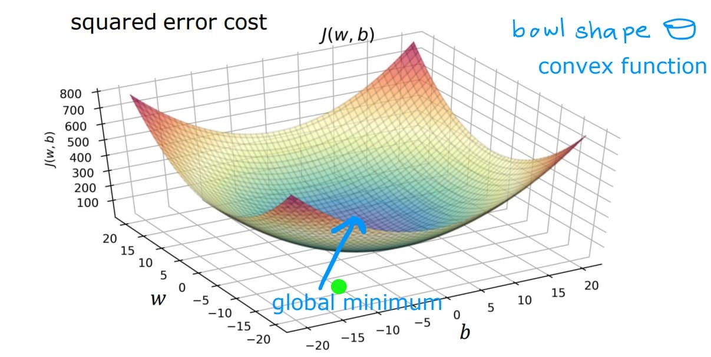

# Linear Regression Logic and concept

### What is Linear Regression?

- ML algorithm to predict a number (not a class)

Examples:
- House price
- Salary
- Marks
- Temperature
### Formula:
y = w.x + b ( for one feature)

y = w1x1 + w2x2 + ... $w_n$ $x_n$ + b (for n features)

Now, what is w and b???

Theoritically, w is how important the feature is (how much effect does it has on the slope as it changes, example, if the feature (xi) changes alot but doesnt affect the slope of the line, then the weight of that feature would be low) 

so: w → tells how much y changes when x increases by 1

and b (intercept) is the value of y (output) when x = 0

Now, to get the best line that fits the data as well as possible, we need the predicted values ($\hat y$) to be as close to the actual value (y).

and so we have...

---

### Cost function:
Because we need to know:

- “Are these w and b good or bad?”

Cost function = how wrong the model is

- Lower cost = better model.

#### Popular cost functions used:
- Mean Squared Error (MSE)
$$
\text{MSE} = \frac{1}{n}\sum_{i=1}^{n}(y_i - \hat{y}_i)^2
$$
- where:
    - $n$ is the number of observations  
    - $y_i$ is the actual (true) value for the $i$-th observation  
    - $\hat{y}_i$ is the predicted value for the $i$-th observation  
    - $(y_i - \hat{y}_i)^2$ is the squared error

- Idea:
    1. prediction − actual
    2. square it
    3.  average over all data points
    - Big mistakes hurt more.

---
MSE Curve:

We calculate the value of MSE for different Ws and Bs and plot a graph. 
Since we are plotting it for 3 dimensions (MSE, w, b), its a 3d graph, and it is like a bowl.

Here we have the value of cost (calculated using MSE) for different values of w (x axis) and b (y axis) 

and we can see that the minimum cost would be at w = 5 and b = 0

so the final Function of linear equation for this data would be:

y_new = w * x_new + b

which equals to:

y_new = 5 * x_new + 0

where y_new is the predicted value (price of the house), x_new is the input value (this can be area of the house)

Low training error ≠ good model

Overfitting happens when model memorizes noise

---
There are more cost functions:
| Cost Function | Punishes big errors? | Robust to outliers | Used for              |
| ------------- | -------------------- | ------------------ | --------------------- |
| MSE           | Yes (a lot)          | ❌                  | Standard regression   |
| MAE           | No                   | ✅                  | Noisy data            |
| RMSE          | Yes                  | ❌                  | Interpretability      |
| Huber         | Medium               | ✅                  | Real-world regression |
| Log Loss      | N/A                  | N/A                | Classification        |

---

Now the question is, how do we get the w and b that will give minimum cost.

so for this, we have cost function which uses **Gradient Descent**.

---
### Gradient Descent:
We use gradient descent to find the best w and b that make the cost (MSE) as small as possible.

Gradient descent is just:

Take small steps downhill on the MSE curve until you reach the bottom.

Steps:

1. Pick random w, b
2. Check which direction reduces MSE
3. Move a little in that direction
4. Repeat

Eventually, you reach the bottom.

What is “gradient” here?

Gradient = direction of steepest increase

So we go in the opposite direction
(because we want error to go down).

**Intuition (human version)**

Each parameter is a knob,
Gradient tells you:

“Turn this knob up a bit, that knob down a bit”

---

### Feature Scaling (Important for Gradient Descent)

When features have very different ranges, gradient descent becomes unstable.

To fix this:

- Scale features to similar ranges

- Helps faster and smoother convergence

Common methods:

1. Standardization (mean = 0, std = 1)

2. Min-Max scaling (range 0–1)

---

### Concrete example for feature scaling (imp):

Dataset:

| Feature | Range |
|---------|-------|
| Age | 0 – 6 |
| House area (sq ft) | 0 – 10,000 |

Model: 

- y = w1·age + w2·area + b

Problem:

- w2 gradients become huge (area dominates)

- w1 barely updates

- Gradient descent struggles to find the minimum

The MSE bowl becomes: long, narrow, tilted valley 😬

### What scaling fixes

After scaling:

| Feature | Range |
|---------|-------|
| Age | ~ -1 – 1 |
| House area (sq ft) | ~ -1 – 1 |

Now: 
1. MSE surface becomes rounder
2. Gradient descent moves smoothly
3. Learning rate behaves predictably

Same model. Same data.
Just better geometry.

---

### Common feature scaling methods:

1. Standardization (most common)

    x_scaled = (x − mean) / standard_deviation

    Results:

    - mean = 0

    - standard deviation = 1

    Used when:

    - data is roughly bell-shaped

    - most ML algorithms (default choice)

2. Min-Max Scaling

    x_scaled = (x − min) / (max − min)

    Results:

    - values in range [0, 1]

    Used when:

    - strict bounds matter

    - neural networks sometimes prefer this

---

### How scaling fits into training (important workflow)

Correct order:

1. Split train / test
2. Fit scaler on training data
3. Transform train data
4. Transform test data using same scaler
5. Train model

Never scale test data independently.
That’s data leakage (quiet but deadly).

---

Now, you may think, how do we move down the graph (to mind the minima), and by how many points/steps

for this, we have **Learning Rate**.

### Learning Rate:

Learning rate = step size

- Too big → you jump over the minimum ❌

- Too small → training is very slow 🐌

- Just right → smooth convergence ✅

#### How do we “get” the learning rate?

Short answer: we choose it.

Common values:
1. 0.1 → aggressive
2. 0.01 → safe default
3. 0.001 → very cautious

In real life:

1. Start with a reasonable value
2. If training is unstable → reduce it
3. If training is too slow → increase it

This is called hyperparameter tuning (fancy term, simple idea).

---
Conclusion (Core idea of ML):
1. Model = formula
2. Weights = importance of inputs
3. Cost = how wrong we are
4. Gradient = which way is downhill
5. Learning rate = how big the step is