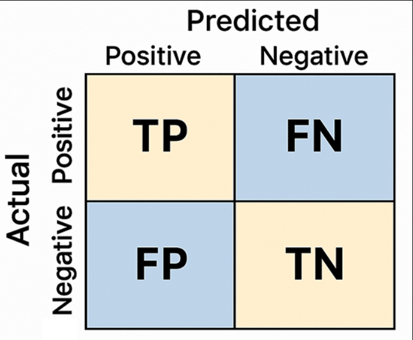

# Classification metrics 


## 1. Accuracy

> Accuray Score = No. of correct pred / Total no. of predictions

If we get an accuracy of 90% , it means, we are 10% in-correct.

But accuracy score doesn't tell us if the mistake was false positive or false negative.


## 2. Confusion Matrix

```python       
    from sklearn.metrics import confusion_metrix

    matrix = confusion_matrix(y_test, y_pred)
    
    print(matrix)

    # OUTPUT:
    '''
    array([[26, 6],
          [ 0, 28]])

    where: 
    1. 26 preds are true positive
    2. 6 preds are false negative
    3. 0 are false positive
    4. 28 are true negative
    '''
```


---

### We can find accuracy score using confusion matrix:

Accuracy = TP + TN / TP + TN + FP + FN

Here: TP + TN are correct preds

---

## Type 1 & Type 2 Errors

- Type 1 = False Positive. 

(we predicted that patient has heart disease, but he doesnt have it.)

- Type 2 =  False Negative 

(we predicted patient is healthy but has heart disease.)