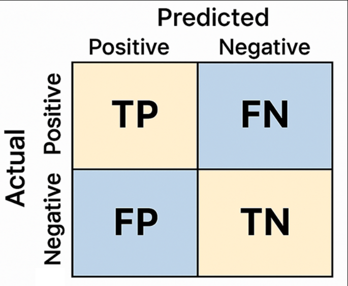
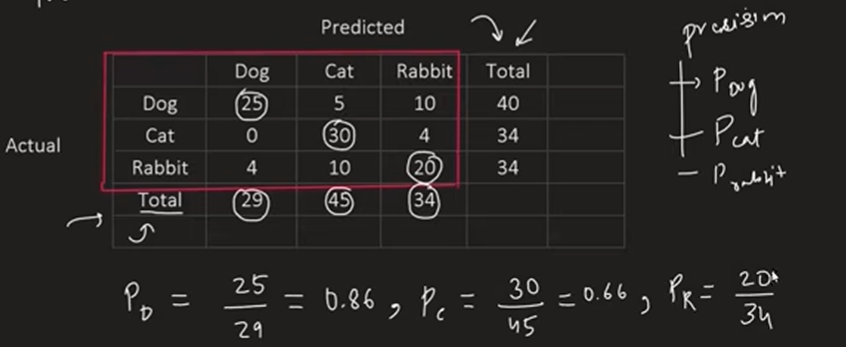

# Classification metrics 


## 1. Accuracy

> Accuray Score = No. of correct pred / Total no. of predictions

If we get an accuracy of 90% , it means, we are 10% in-correct.

But accuracy score doesn't tell us if the mistake was false positive or false negative.


## 2. Confusion Matrix

“Positive” and “Negative” refer to what the MODEL PREDICTED — not reality.

* Positive = model said YES (cat)
* Negative = model said NO (not cat)

Then:

* True/False = whether that prediction was correct or wrong

```python       
    from sklearn.metrics import confusion_metrix

    matrix = confusion_matrix(y_test, y_pred)
    
    print(matrix)

    # OUTPUT:
    '''
    array([[26, 6],
          [ 0, 28]])

    where: 
    1. 26 preds are true positive
    2. 6 preds are false negative
    3. 0 are false positive
    4. 28 are true negative
    '''
```


---

### We can find accuracy score using confusion matrix:

Accuracy = TP + TN / TP + TN + FP + FN

Here: TP + TN are correct preds

---

## Type 1 & Type 2 Errors

- Type 1 = False Positive. 

(we predicted that patient has heart disease, but he doesnt have it.)

- Type 2 =  False Negative 

(we predicted patient is healthy but has heart disease.)

---

# Precision, Recall and F1 Score

1. **Precision**: 

    > What proportion of prediced positives is truly positive 

    How to compare to confusion matrix in-order to determine which model is better.

    Lets take an example of Spam Email:

    ${Model_A}$ has 30 false positives, and 170 false negatives

    ${Model_B}$ has 10 false positives, and 190 false negatives.

    So for email spam condition, ${Model_B}$ is better because we dont want an important email to be classified as spam and we miss it.

    hence:
    
    **Precision** = TP / (TP+FP)

    And when we calculate this precision for both the Models, if TP is same.
    Then precision of B is better than precision of A.

2. **Recall**:

    > What proportion of actual positive is correctly classfied.

    **Recall** = TP / (TP+FN)

    Lets take an example of cancer detection.

    A person doesn't have cancer but our model detects that it has cancer its detecting the false positive which is not a big concern in our model but when a model detect that the patient doesn't have cancer but patient actually has cancer then it becomes very dangerous and patient might die. 
    This condition is False negative. 
    Because the model said, **NO CANCER** (so Negative) and Prediction was wrong (so False) 

## Based on our understanding wheather TYPE 1 (Precision) error is difficult or TYPE 2 (Recall) error is difficult, we choose either Precision or Recall

3. **F1 Score**:

    The Problem: Sometimes you cannot afford to ignore either False Positives or False Negatives. However, Precision and Recall share a trade-off (increasing one usually decreases the other).

    The Solution: The F1 Score combines both metrics into a single value.

    Formula: 2 * (Precision * Recall) / (Precision + Recall)

    *Why Harmonic Mean?* 
    > F1 Score uses the Harmonic Mean rather than a simple Arithmetic Mean. The harmonic mean heavily penalizes extreme values and tends to stay closer to the lower value of the two. This ensures that if either your Precision or Recall is terribly low, your overall F1 Score will also be low, appropriately penalizing the model.

---

### Metrics for Multi-Class Classification

In binary classification, the focus is strictly on the positive class (e.g., "1"). In multi-class classification (e.g., predicting Dog, Cat, or Rabbit), you must calculate Precision, Recall, and F1 Score for each individual class first.

Macro Average: Calculates the arithmetic mean of the metric across all classes (e.g., (Precision of Dog + Precision of Cat + Precision of Rabbit) / 3). 

Use this when your classes are balanced.

Weighted Average: Multiplies the metric of each class by its proportionate weight (percentage of occurrences in the dataset) before summing them up. Use this when your classes are highly imbalanced.



Just like in the above image we calculated precision, we calculate Recall similary for multi class clasification.

So for example, the recall for Dog class would be:

${R_{Dog}} = 25 / (25 + 15) $ 

We can have **Macro** and **Weighted** recall.

---

```python       

from sklearn.metrics import precision_score, recall_score, f1_score

precision_score(y_test, y_pred, average=None) # to see precision values for all the available classes

precision_score(y_test, y_pred, average='weighted') # to see precision values with weighted average, so that if any class is dominating, or if any is very less, their weights average their contribution in precision 

precision_score(y_test, y_pred, average='macro') # to see precision values with macro average


```